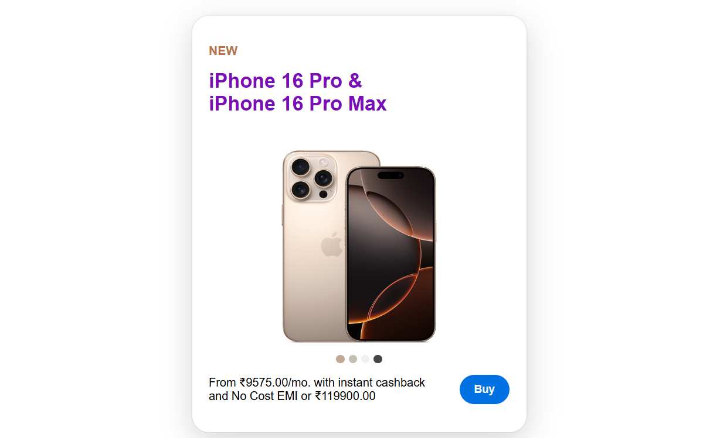

# IPHONE CARD

## Preview 📸
Open the Project click [here](https://naveenkumar-developer.github.io/iPhoneCard/)

## Features 🚀

-  **Interactive Hover Effects**: The card scales up on hover, and a "Closer Look" section appears for additional information.

- **Clean Typography**: Utilizes Google Fonts for a clean and readable interface.

## CSS 📝

- **Global Styles**: Basic resets are applied for padding, margins, and box-sizing.
  
- **Fonts**: Multiple Google Fonts are imported for various text elements.
  
- **Container**: The main container is centered using display: grid with place-content: center.
  
- **iPhoneCard**: The main card element styled with a shadow, scaling effect on hover, and a rounded corner.
  
- **Color Indicators**: Circles representing available phone colors.

## Key classes 📝

- iPhoneCard: Main container for the card.
  
- tag, .phoneModel: Styling for phone model text and tags.

- phoneImg_container: Image container with overflow control.

- colors: Contains color circles.
  
- closerLook: Hidden section that appears on hover for a closer look at the product.

## Notes 🤝

- Feature i will add contents for closerLook.
